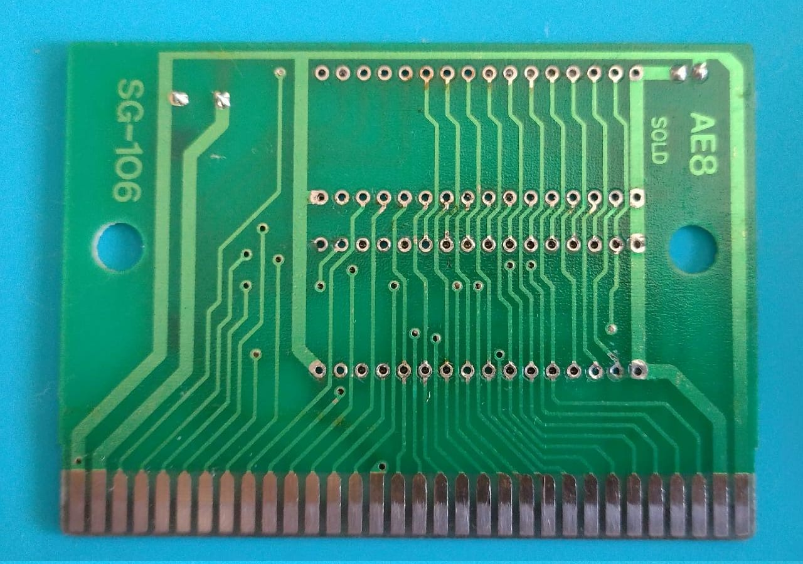

# DoctorColeco presenta:
# XKA-SEGA-control-test-cart
XKA SEGA test cart dump para preservación

Hace unas semanas apareció Nahuel en un grupo comentando que tenía este cartucho, que no era un juego sino un programa de test para SEGA GENESIS. Me interesó porque tengo carts de este tipo para Colecovision, Atari 2600 y SNES pero no de SEGA. Por lo que nos pusimos con los amigos de Retro Fixers a buscar la rom pero no aparecia nada por ningún lado sobre el cartucho. Ni fotos, ni dumps, nada. Así que la cosa se puso interesante y comenzamos a charlar con su dueño para organizar el procedimiento de preservación (habilitando la posible clonación del mismo) del cartucho. Muchas gracias a Nahuel Retegui por prestar esta pieza única para poder realizar trabajo de volcado de las eprom y las fotos de la placa PCB y la etiqueta. Realizado en el mes de septiembre de 2023 en el Lab de DoctorColeco en Floresta, Ciudad de Buenos Aires, Argentina.

A few weeks ago Nahuel appeared in a group commenting that he had this cartridge, which was not a game but a test program for SEGA GENESIS. I was interested because I have carts of this type for Colecovision, Atari 2600 and SNES but not from SEGA. So we started looking for the rom with our friends at Retro Fixers but nothing appeared anywhere about the cartridge. No photos, no dumps, nothing. So things got interesting and we started chatting with its owner to organize the preservation procedure (enabling its possible cloning) of the cartridge. Many thanks to Nahuel Retegui for providing this unique piece to be able to do the work of dumping the eproms and the photos of the PCB board and the label. Carried out in September 2023 at the DoctorColeco Lab in Floresta, City of Buenos Aires, Argentina.

EPROM 27C010 (I) dump .BIN)

EPROM 27C010 (II) dump .BIN)

## ROM
.bin)

Joined LO and HI usando ésta herramienta https://www.romhacking.net/utilities/1621/

## Emulador
sudo apt install blastem

## Donantes * (sin chequear!)
listado: https://www.jensma.de/md/index.php?search=5003

## Imágenes

## Gracias
Retro Fixers Game Club

Ale Smukler

Dario Garcia

Luciano ComYVen

Alecu

Nahuel Retegui
